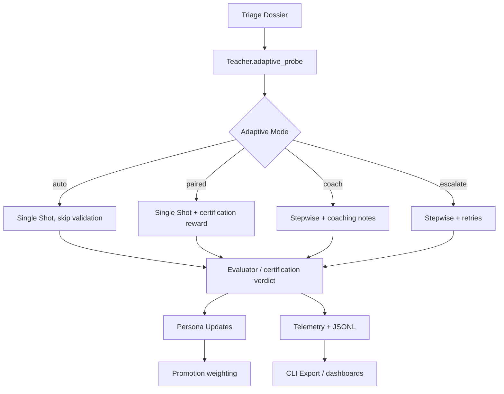

# Adaptive Runtime Guide

**Last updated:** 2025-10-13  
**Audience:** Runtime / DX engineers and BYOA partners  

This guide explains how Atlas SDK’s continual-learning runtime wires triage → capability
probe → adaptive controller, how to customise the configuration surface, and how to
inspect runs via the CLI. You can exercise the full loop with a single YAML file—storage
and telemetry exporters are optional add-ons when you’re ready to persist runs.

---

## 1. Flow Overview

1. **Triage dossier** – Every run starts by invoking a triage adapter which returns a
   structured dossier (`summary`, `risks`, `signals`, persona references, embeddings).
2. **Capability probe** – The teacher consumes the dossier plus persona statistics and
   emits `{mode, confidence, evidence, recommended_personas}`. If the fingerprint has no
   history and `certify_first_run` is enabled, we skip the probe and force a one-time
   certification (`paired` mode).
3. **Adaptive controller** – The orchestrator records the probe payload and routes the
   student into one of four modes:
   - `auto` – single shot; validation skipped.
   - `paired` – single shot; final answer validated once.
   - `coach` – stepwise; teacher supplies compact coaching guidance.
   - `escalate` – stepwise; full guidance and retries.
4. **Reward + Memory** – Certification verdicts are reused as the reward signal,
   avoiding a second evaluator pass. Persona metadata (helpful/harmful counts, last mode,
   tags) and usage records capture the adaptive outcome for telemetry and promotion.
5. **Adaptive summary** – Every run emits an `adaptive_summary` block capturing the active
   mode, confidence, certification status, and probe details. The console streamer surfaces
   this alongside reward highlights so you can track the J-curve trend before exporting data.

Mermaid summary (mirrors `docs/adaptive_controller.md`):



---

## 2. Lightweight Default Setup

The quickest path is to leave `storage: null` in your config and run:

```python
from atlas import core

result = core.run(
    task="Summarise the latest Atlas SDK updates in 3 bullet points.",
    config_path="configs/examples/openai_agent.yaml",
    stream_progress=True,  # optional console telemetry with adaptive summary + reward
)

print("Final answer:", result.final_answer)
```

The console output will show the reviewed plan, per-step verdicts, and a session summary such as:

```
Summary | execution_mode=coach | adaptive_confidence=0.68 | certification=True | Reward score=0.87
```

When you later enable storage, the same metadata flows into JSONL exports via `adaptive_summary`,
`session_reward`, and learning notes—perfect for plotting an adaptive J-curve or auditing persona changes.

## 3. Configuration Surface

`AtlasConfig.adaptive_teaching` now accepts the following fields:

```yaml
adaptive_teaching:
  enabled: true
  certify_first_run: true
  mode_override: null        # "auto" | "paired" | "coach" | "escalate"
  triage_adapter: atlas.utils.triage:default_build_dossier
  default_tags:
    - tenant:example
    - domain:sre
  probe:
    thresholds:
      auto: 0.85
      paired: 0.65
      coach: 0.40
    fallback_mode: coach
    evidence_limit: 6
    timeout_seconds: 15
  reward:
    type: rim              # or "python"
    import_path: null      # required when type="python"
```

- **Triage adapter** – Provide a dotted path (`module:callable` or `module.callable`). Use
  `atlas triage init --domain <sre|support|code|custom>` to scaffold a custom adapter.
- **Default tags** – Automatically attached to persona memory entries and surfaced in
  telemetry.
- **Mode override** – Forces the controller into a specific lane when manual governance
  is required.
- **Probe thresholds** – Confidence bands mapping the probe score to modes; fallback mode
  is used on timeout/error.

Starter adapters live under `examples/triage_adapters/` for reference.

---

## 4. Telemetry & CLI Usage

### Console output

`ConsoleTelemetryStreamer` now prints adaptive insights at the end of each run:

```
Adaptive: mode=coach confidence=0.58
  probe -> mode=coach confidence=0.55
  probe evidence: persona_helpful_ratio=0.62, risk_high_severity
  recent decisions: paired(certification_required); coach(probe)
```

### JSONL export

`atlas.export` (aliased as `arc-atlas` / `atlas-export`) writes session records that
include the new adaptive fields:

```json
{
  "task": "...",
  "adaptive_summary": {
    "adaptive_mode": "paired",
    "confidence": 0.81,
    "certification_run": true,
    "probe": {
      "mode": "paired",
      "confidence": 0.81,
      "evidence": ["persona_helpful_ratio=0.92"]
    },
    "mode_history": [...]
  },
  "triage_dossier": { ... },
  "personas_used": [...],
  "persona_updates": { "new_candidates": [...], "promotion_result": {...} },
  "teacher_notes": ["Include explicit TLS verification steps."],
  "reward_summary": { "average": 0.88, "count": 3 },
  "steps": [...]
}
```

Export command examples:

```bash
# Export recent sessions with full adaptive metadata
arc-atlas \
  --database-url postgresql://localhost:5432/atlas \
  --output traces.jsonl \
  --limit 50

# Export a certification session by id
arc-atlas \
  --database-url ... \
  --output cert.jsonl \
  --session-id 1024
```

---

## 5. Developer Checklist

1. Configure `adaptive_teaching` in your Atlas config (triage adapter, thresholds, tags).
2. Use `atlas triage init` to scaffold a dossier builder for your domain.
3. Run the runtime (`atlas.core.run(...)`) and inspect console output for adaptive summaries.
4. Export traces via `arc-atlas` and feed them into dashboards or Atlas Core training.

By keeping triage, probe, and adaptive routing first-class, the harness captures a rich,
auditable signal each run while staying easy to customise for new domains.
